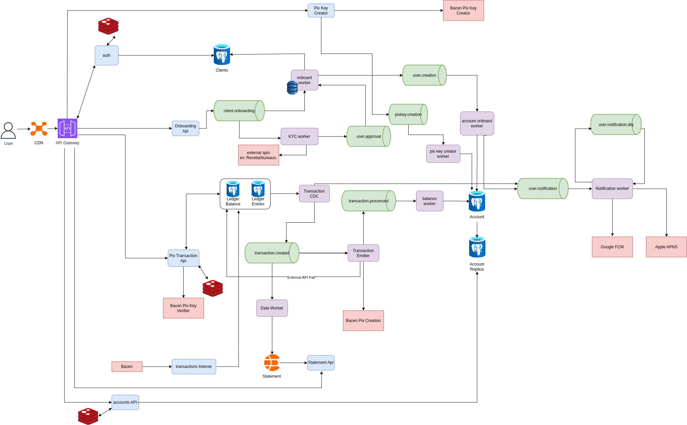

# pix-bank-system-design

> **Architecture study — not implemented.** This repository documents the design of a
> Pix-based digital bank: the architecture, the reasoning, and the trade-offs. There is
> no running code here.

An event-driven architecture for a digital bank (Nubank-style) sized for **~2M registered
clients** and **600–800k daily active users**, with a strongly consistent ledger as the
source of truth. The goal of the study was to justify each architectural decision against
explicit non-functional requirements, not to ship a product.

## Architecture

**Legend:** blue boxes are services, green pipes are Kafka brokers, purple boxes are
workers and CDCs, red boxes are external APIs. The API gateway and all blue services sit
behind load balancers, omitted from the diagram for readability.

## CAP choice: CP

A bank cannot trade away consistency — money must not vanish, duplicate, or be read
incorrectly. The authoritative balance and the ledger are therefore **strongly
consistent** (locking + ACID, no double-spend). Display balance and statements are
**eventually consistent** (up to ~2s behind the ledger), fed asynchronously by CDC. The
consistency boundaries are explicit and deliberate, not accidental.

## Non-functional targets

The design is dimensioned against concrete targets rather than vague goals:

| Concern | Target |
| --- | --- |
| Internal debit (balance check + ledger write) | 100 ms p99 |
| Balance query | 200 ms p99 |
| Statement, first page (filtered) | 400 ms p95 |
| Pix confirmation to client (without waiting for Bacen) | 500 ms p95 |
| Login | 300 ms p95 |
| Write throughput (peak) | ~1,000 tx/s |
| Read throughput (peak) | ~5,000 req/s |
| Payroll surge (5th & 10th of month) | 2–4× normal volume |
| Availability on the transaction path | 99.95% monthly |

## Main flows

- **Account creation** — Onboarding API publishes to Kafka, consumed in parallel by an
  onboard worker (holds partial state in DynamoDB with TTL) and a KYC worker (calls
  Receita/bureaus). On approval, the client is persisted to Postgres and an account is
  created; a dedicated DLQ guards against the "client created but account missing"
  inconsistency.
- **Sending a Pix** — the transaction is committed to the sharded ledger as a local ACID
  transaction; the client is confirmed immediately. The call to Bacen happens
  asynchronously down the CDC → `transaction.created` → emitter pipeline. On external
  rejection, a compensating ledger entry reverses it.
- **Receiving a transaction** — Bacen pushes an approved transaction; it is handled
  idempotently and applied to the ledger, updating the authoritative balance.
- **Statement** — served from Elasticsearch, built by a data worker from CDC events, so
  filtered queries never scan the write-heavy ledger.
- **Balance / account data** — served from an Account read replica plus Redis cache,
  isolating high-volume reads from the write path.

## Key design trade-offs

The core of the study. Each choice is stated with what it costs, not just what it buys.

- **Sharding the ledger by account.** Co-locating an account's balance and entries in one
  shard turns a debit into a local ACID transaction (`SELECT ... FOR UPDATE`), avoiding a
  distributed transaction / 2PC just to debit a single account. This is the main win, at
  the cost of cross-account operations being harder.
- **Two balance concepts.** An *authoritative* balance (strongly consistent, locked, in
  the ledger shard, checked only when executing transactions) and a *display* balance
  (eventually consistent, CDC-fed, used only for showing the balance in the app). Splits
  the expensive consistent read from the cheap frequent read.
- **Elasticsearch for statements.** Querying the ledger at this scale is expensive and it
  is already write-saturated; a search store gives fast, filterable reads for a large,
  costly-to-compute statement — at the cost of eventual consistency and an extra system to
  operate.
- **Separate KYC service.** Keeps service logic isolated and prevents the onboard worker
  from becoming a monolith, accepting extra operational cost for a cleaner boundary.
- **DLQ + Schema Registry (Avro) as complementary controls.** The DLQ catches messages
  that fail to *process*; the schema registry prevents producer/consumer schema drift so
  messages don't fail to *deserialize*. DLQs are placed only on critical consumers
  (onboarding, notification) where silent loss would hurt most, rather than on every
  topic, to keep operational cost down.
- **Idempotency + outbox via CDC.** An event is emitted only after its change is committed
  to the database, closing the write-then-publish gap; idempotent consumers turn
  at-least-once delivery into an exactly-once effect.

## Known boundaries

Honest edges of the design, worth knowing before reading it as finished:

- In the send-Pix flow the client is confirmed before Bacen responds, so there is a window
  where the debit has happened locally but the external transfer can still fail and be
  reversed by a compensating entry. This is a deliberate latency-vs-finality trade-off.
- The evaluation is a design study; the targets are dimensioned, not measured against a
  running system.

## Authors

- João Paulo Soares Lopes
- Bruno José Barros Rêgo

Produced as coursework for Tópicos de Computação Avançados VII (PUC-Rio).
